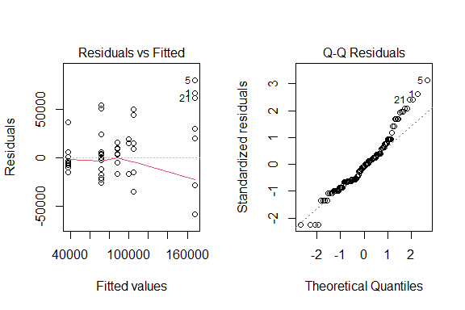
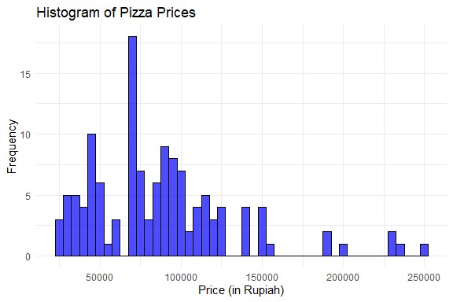
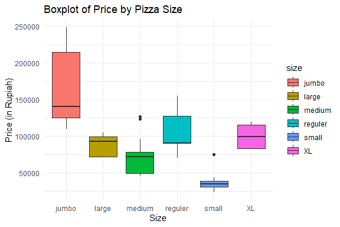
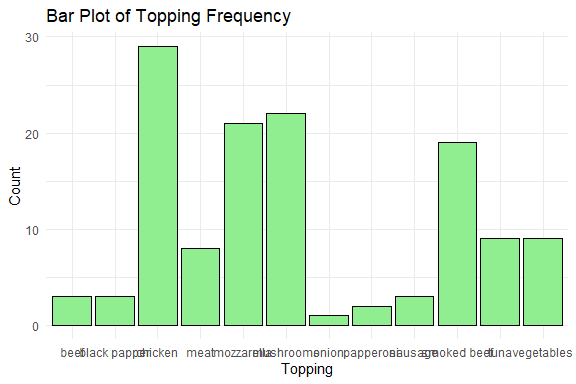
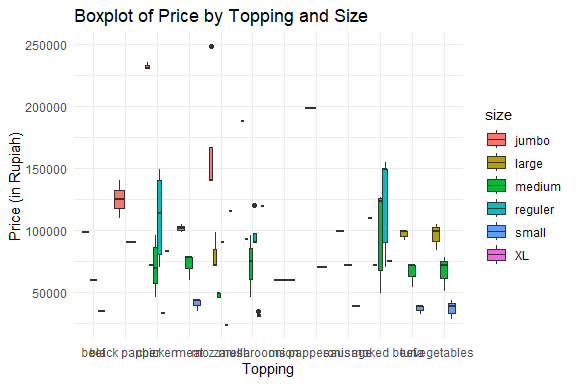
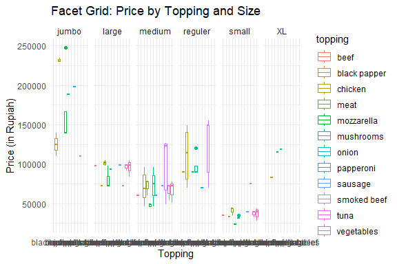
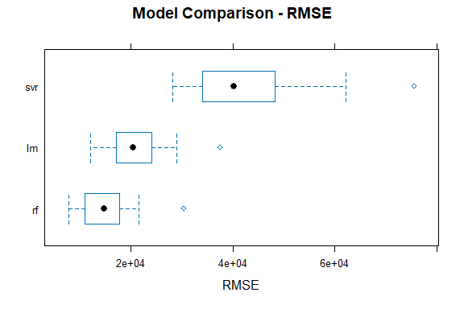
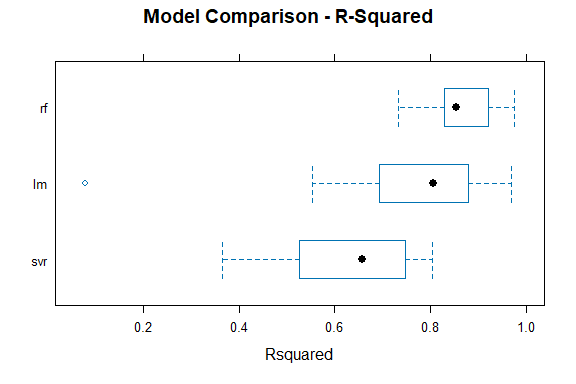

Pizza Price Prediction
================
Trevor Okinda
2024

- [Student Details](#student-details)
- [Setup Chunk](#setup-chunk)
  - [Source:](#source)
  - [Reference:](#reference)
- [Understanding the Dataset (Exploratory Data Analysis
  (EDA))](#understanding-the-dataset-exploratory-data-analysis-eda)
  - [Loading the Dataset](#loading-the-dataset)
  - [Measures of Frequency](#measures-of-frequency)
  - [Measures of Central Tendency](#measures-of-central-tendency)
  - [Measures of Distribution](#measures-of-distribution)
  - [Measures of Relationship](#measures-of-relationship)
  - [ANOVA](#anova)
  - [Plots](#plots)
- [Preprocessing & Data
  Transformation](#preprocessing--data-transformation)
  - [Missing Values](#missing-values)
- [Training Models](#training-models)
  - [Data Splitting](#data-splitting)
  - [Cross-validation](#cross-validation)
  - [Training Different Models](#training-different-models)
  - [Evaluate Models on Test data](#evaluate-models-on-test-data)
  - [Performance Comparison with
    resamples](#performance-comparison-with-resamples)
  - [Saving Model](#saving-model)

# Student Details

|                       |                        |
|-----------------------|------------------------|
| **Student ID Number** | 134780                 |
| **Student Name**      | Trevor Okinda          |
| **BBIT 4.2 Group**    | C                      |
| **Project Name**      | Pizza Price Prediction |

# Setup Chunk

**Note:** the following KnitR options have been set as the global
defaults: <BR>
`knitr::opts_chunk$set(echo = TRUE, warning = FALSE, eval = TRUE, collapse = FALSE, tidy = TRUE)`.

More KnitR options are documented here
<https://bookdown.org/yihui/rmarkdown-cookbook/chunk-options.html> and
here <https://yihui.org/knitr/options/>.

### Source:

The dataset that was used can be downloaded here: *\<<a
href="https://www.kaggle.com/datasets/knightbearr/pizza-price-prediction?select=pizza_v2.csv\"
class="uri">https://www.kaggle.com/datasets/knightbearr/pizza-price-prediction?select=pizza_v2.csv\</a>\>*

### Reference:

*\<Knightbearr. (n.d.). Pizza Price Prediction (Playground Data) \[Data
set\]. Kaggle. Retrieved April 24, 2025, from <a
href="https://www.kaggle.com/datasets/knightbearr/pizza-price-prediction?select=pizza_v2.csv\"
class="uri">https://www.kaggle.com/datasets/knightbearr/pizza-price-prediction?select=pizza_v2.csv\</a>\>  
Refer to the APA 7th edition manual for rules on how to cite datasets:
<https://apastyle.apa.org/style-grammar-guidelines/references/examples/data-set-references>*

# Understanding the Dataset (Exploratory Data Analysis (EDA))

## Loading the Dataset

``` r
# Load the dataset
PizzaData <- read.csv("pizza_v1.csv", colClasses = c(
  company = "factor",
  price_rupiah = "numeric",
  diameter = "numeric",
  topping = "factor",
  variant = "factor",
  size = "factor",
  extra_sauce = "factor",
  extra_cheese = "factor"
))

# Display structure to verify data types
str(PizzaData)
```

    ## 'data.frame':    129 obs. of  8 variables:
    ##  $ company     : Factor w/ 5 levels "A","B","C","D",..: 1 1 1 1 1 1 1 1 1 1 ...
    ##  $ price_rupiah: num  235000 198000 120000 155000 248000 140000 110000 70000 90000 90000 ...
    ##  $ diameter    : num  22 20 16 14 18 18.5 16 8 12 12 ...
    ##  $ topping     : Factor w/ 12 levels "beef","black papper",..: 3 8 6 10 5 2 10 8 6 10 ...
    ##  $ variant     : Factor w/ 20 levels "american_classic",..: 9 9 9 9 9 2 2 2 2 2 ...
    ##  $ size        : Factor w/ 6 levels "jumbo","large",..: 1 1 4 4 1 1 1 4 4 4 ...
    ##  $ extra_sauce : Factor w/ 2 levels "no","yes": 2 2 2 2 2 1 1 1 2 1 ...
    ##  $ extra_cheese: Factor w/ 2 levels "no","yes": 2 2 2 1 1 1 2 1 1 1 ...

``` r
# Display the first few rows to ensure data is loaded correctly
head(PizzaData)
```

    ##   company price_rupiah diameter      topping           variant    size
    ## 1       A       235000     22.0      chicken  double_signature   jumbo
    ## 2       A       198000     20.0    papperoni  double_signature   jumbo
    ## 3       A       120000     16.0    mushrooms  double_signature reguler
    ## 4       A       155000     14.0  smoked beef  double_signature reguler
    ## 5       A       248000     18.0   mozzarella  double_signature   jumbo
    ## 6       A       140000     18.5 black papper american_favorite   jumbo
    ##   extra_sauce extra_cheese
    ## 1         yes          yes
    ## 2         yes          yes
    ## 3         yes          yes
    ## 4         yes           no
    ## 5         yes           no
    ## 6          no           no

``` r
# View the dataset in a spreadsheet-like interface (optional)
View(PizzaData)
```

## Measures of Frequency

``` r
# Measures of Frequency for categorical variables (e.g., company, topping, variant)
company_freq <- table(PizzaData$company)
topping_freq <- table(PizzaData$topping)
variant_freq <- table(PizzaData$variant)
size_freq <- table(PizzaData$size)

# Display frequency tables
print(company_freq)
```

    ## 
    ##  A  B  C  D  E 
    ## 25 24 30 20 30

``` r
print(topping_freq)
```

    ## 
    ##         beef black papper      chicken         meat   mozzarella    mushrooms 
    ##            3            3           29            8           21           22 
    ##        onion    papperoni      sausage  smoked beef         tuna   vegetables 
    ##            1            2            3           19            9            9

``` r
print(variant_freq)
```

    ## 
    ##  american_classic american_favorite   BBQ_meat_fiesta       BBQ_sausage 
    ##                 3                 5                 5                 3 
    ##           classic           crunchy     double_decker        double_mix 
    ##                30                10                 9                10 
    ##  double_signature      extravaganza     gournet_greek    italian_veggie 
    ##                 5                 3                 3                 3 
    ##        meat_eater       meat_lovers      neptune_tuna          new_york 
    ##                 3                10                 3                10 
    ##        spicy tuna        spicy_tuna     super_supreme       thai_veggie 
    ##                 3                 3                 5                 3

``` r
print(size_freq)
```

    ## 
    ##   jumbo   large  medium reguler   small      XL 
    ##      15      21      41      20      22      10

``` r
# For extra features: Frequency of 'extra_sauce' and 'extra_cheese'
extra_sauce_freq <- table(PizzaData$extra_sauce)
extra_cheese_freq <- table(PizzaData$extra_cheese)

# Display these frequencies
print(extra_sauce_freq)
```

    ## 
    ##  no yes 
    ##  53  76

``` r
print(extra_cheese_freq)
```

    ## 
    ##  no yes 
    ##  43  86

## Measures of Central Tendency

``` r
# Mean (average) of price_rupiah and diameter
mean_price <- mean(PizzaData$price_rupiah)
mean_diameter <- mean(PizzaData$diameter)

# Median (middle value) of price_rupiah and diameter
median_price <- median(PizzaData$price_rupiah)
median_diameter <- median(PizzaData$diameter)

# Mode (most frequent value) - Custom function for mode
get_mode <- function(x) {
  uniq_x <- unique(x)
  uniq_x[which.max(tabulate(match(x, uniq_x)))]
}

# Mode for categorical variables
mode_topping <- get_mode(PizzaData$topping)
mode_variant <- get_mode(PizzaData$variant)
mode_size <- get_mode(PizzaData$size)

# Display results
print(paste("Mean Price:", mean_price))
```

    ## [1] "Mean Price: 87151.1627906977"

``` r
print(paste("Mean Diameter:", mean_diameter))
```

    ## [1] "Mean Diameter: 12.9767441860465"

``` r
print(paste("Median Price:", median_price))
```

    ## [1] "Median Price: 78000"

``` r
print(paste("Median Diameter:", median_diameter))
```

    ## [1] "Median Diameter: 12"

``` r
print(paste("Mode Topping:", mode_topping))
```

    ## [1] "Mode Topping: chicken"

``` r
print(paste("Mode Variant:", mode_variant))
```

    ## [1] "Mode Variant: classic"

``` r
print(paste("Mode Size:", mode_size))
```

    ## [1] "Mode Size: medium"

## Measures of Distribution

``` r
# Variance and Standard Deviation for price_rupiah and diameter
var_price <- var(PizzaData$price_rupiah)
sd_price <- sd(PizzaData$price_rupiah)

var_diameter <- var(PizzaData$diameter)
sd_diameter <- sd(PizzaData$diameter)

# Range (minimum and maximum) for price_rupiah and diameter
range_price <- range(PizzaData$price_rupiah)
range_diameter <- range(PizzaData$diameter)

# Interquartile Range (IQR) for price_rupiah and diameter
iqr_price <- IQR(PizzaData$price_rupiah)
iqr_diameter <- IQR(PizzaData$diameter)

# Display results
print(paste("Variance in Price:", var_price))
```

    ## [1] "Variance in Price: 1998635174.4186"

``` r
print(paste("Standard Deviation in Price:", sd_price))
```

    ## [1] "Standard Deviation in Price: 44706.0977319493"

``` r
print(paste("Range of Price:", range_price))
```

    ## [1] "Range of Price: 23500"  "Range of Price: 248000"

``` r
print(paste("IQR of Price:", iqr_price))
```

    ## [1] "IQR of Price: 54000"

``` r
print(paste("Variance in Diameter:", var_diameter))
```

    ## [1] "Variance in Diameter: 10.7103924418605"

``` r
print(paste("Standard Deviation in Diameter:", sd_diameter))
```

    ## [1] "Standard Deviation in Diameter: 3.27267359231874"

``` r
print(paste("Range of Diameter:", range_diameter))
```

    ## [1] "Range of Diameter: 8"  "Range of Diameter: 22"

``` r
print(paste("IQR of Diameter:", iqr_diameter))
```

    ## [1] "IQR of Diameter: 2"

``` r
# Skewness and Kurtosis for price_rupiah
library(e1071)
skew_price <- skewness(PizzaData$price_rupiah)
kurt_price <- kurtosis(PizzaData$price_rupiah)

print(paste("Skewness of Price:", skew_price))
```

    ## [1] "Skewness of Price: 1.28984566682905"

``` r
print(paste("Kurtosis of Price:", kurt_price))
```

    ## [1] "Kurtosis of Price: 2.18706942724476"

## Measures of Relationship

``` r
# Correlation between price_rupiah and diameter (only for numerical variables)
cor_price_diameter <- cor(PizzaData$price_rupiah, PizzaData$diameter)

# Cross-tabulation between categorical variables (e.g., company and size)
company_size_crosstab <- table(PizzaData$company, PizzaData$size)

# Display results
print(paste("Correlation between Price and Diameter:", cor_price_diameter))
```

    ## [1] "Correlation between Price and Diameter: 0.826977283030344"

``` r
print("Company and Size Cross-tabulation:")
```

    ## [1] "Company and Size Cross-tabulation:"

``` r
print(company_size_crosstab)
```

    ##    
    ##     jumbo large medium reguler small XL
    ##   A    11     0      0      14     0  0
    ##   B     0     4     12       0     4  4
    ##   C     0    10     10       0    10  0
    ##   D     4     2      5       6     2  1
    ##   E     0     5     14       0     6  5

## ANOVA

``` r
# ANOVA for price based on pizza size
anova_size <- aov(price_rupiah ~ size, data = PizzaData)

# Display ANOVA table for size
summary(anova_size)
```

    ##              Df    Sum Sq   Mean Sq F value Pr(>F)    
    ## size          5 1.689e+11 3.378e+10    47.8 <2e-16 ***
    ## Residuals   123 8.692e+10 7.067e+08                   
    ## ---
    ## Signif. codes:  0 '***' 0.001 '**' 0.01 '*' 0.05 '.' 0.1 ' ' 1

``` r
# Post-hoc test if ANOVA for size is significant
tukey_size <- TukeyHSD(anova_size)

# Display the post-hoc test results
print(tukey_size)
```

    ##   Tukey multiple comparisons of means
    ##     95% family-wise confidence level
    ## 
    ## Fit: aov(formula = price_rupiah ~ size, data = PizzaData)
    ## 
    ## $size
    ##                      diff         lwr        upr     p adj
    ## large-jumbo     -79276.19 -105294.446  -53257.93 0.0000000
    ## medium-jumbo    -96165.85 -119389.941  -72941.77 0.0000000
    ## reguler-jumbo   -62850.00  -89137.882  -36562.12 0.0000000
    ## small-jumbo    -129959.09 -155729.784 -104188.40 0.0000000
    ## XL-jumbo        -68000.00  -99420.029  -36579.97 0.0000001
    ## medium-large    -16889.66  -37542.346    3763.02 0.1759296
    ## reguler-large    16426.19   -7620.177   40472.56 0.3610707
    ## small-large     -50682.90  -74162.757  -27203.04 0.0000001
    ## XL-large         11276.19  -18293.951   40846.33 0.8788821
    ## reguler-medium   33315.85   12324.512   54307.20 0.0001515
    ## small-medium    -33793.24  -54133.156  -13453.32 0.0000627
    ## XL-medium        28165.85    1021.759   55309.95 0.0371503
    ## small-reguler   -67109.09  -90887.375  -43330.81 0.0000000
    ## XL-reguler       -5150.00  -34957.657   24657.66 0.9960837
    ## XL-small         61959.09   32606.540   91311.64 0.0000002

``` r
# Check assumptions:
# 1. Residuals vs Fitted plot (for homogeneity of variances)
# 2. Normal Q-Q plot (for normality of residuals)
par(mfrow = c(1, 2))  # Set up two plots side by side
plot(anova_size, 1)   # Residuals vs Fitted plot
plot(anova_size, 2)   # Normal Q-Q plot
```

<!-- -->

``` r
# Levene's Test for homogeneity of variances
library(car)
```

    ## Loading required package: carData

``` r
leveneTest(price_rupiah ~ size, data = PizzaData)
```

    ## Levene's Test for Homogeneity of Variance (center = median)
    ##        Df F value    Pr(>F)    
    ## group   5    7.62 2.881e-06 ***
    ##       123                      
    ## ---
    ## Signif. codes:  0 '***' 0.001 '**' 0.01 '*' 0.05 '.' 0.1 ' ' 1

``` r
# ANOVA for price based on topping type
anova_topping <- aov(price_rupiah ~ topping, data = PizzaData)
summary(anova_topping)
```

    ##              Df    Sum Sq   Mean Sq F value Pr(>F)
    ## topping      11 2.562e+10 2.329e+09   1.183  0.306
    ## Residuals   117 2.302e+11 1.968e+09

``` r
# Post-hoc test if ANOVA for topping is significant
tukey_topping <- TukeyHSD(anova_topping)
print(tukey_topping)
```

    ##   Tukey multiple comparisons of means
    ##     95% family-wise confidence level
    ## 
    ## Fit: aov(formula = price_rupiah ~ topping, data = PizzaData)
    ## 
    ## $topping
    ##                                  diff        lwr       upr     p adj
    ## black papper-beef         49000.00000  -71796.82 169796.82 0.9698401
    ## chicken-beef              31218.39080  -58507.23 120944.01 0.9908737
    ## meat-beef                  3416.66667  -96742.76 103576.10 1.0000000
    ## mozzarella-beef           23023.80952  -68290.00 114337.62 0.9994766
    ## mushrooms-beef            22939.39394  -68114.63 113993.42 0.9994807
    ## onion-beef                -4333.33333 -175165.83 166499.16 1.0000000
    ## papperoni-beef            69666.66667  -65388.28 204721.61 0.8551655
    ## sausage-beef               5666.66667 -115130.15 126463.48 1.0000000
    ## smoked beef-beef          35982.45614  -55930.14 127895.05 0.9768567
    ## tuna-beef                  2111.11111  -96519.08 100741.30 1.0000000
    ## vegetables-beef            2333.33333  -96296.85 100963.52 1.0000000
    ## chicken-black papper     -17781.60920 -107507.23  71944.01 0.9999500
    ## meat-black papper        -45583.33333 -145742.76  54576.10 0.9326995
    ## mozzarella-black papper  -25976.19048 -117290.00  65337.62 0.9984011
    ## mushrooms-black papper   -26060.60606 -117114.63  64993.42 0.9983105
    ## onion-black papper       -53333.33333 -224165.83 117499.16 0.9963489
    ## papperoni-black papper    20666.66667 -114388.28 155721.61 0.9999964
    ## sausage-black papper     -43333.33333 -164130.15  77463.48 0.9883022
    ## smoked beef-black papper -13017.54386 -104930.14  78895.05 0.9999984
    ## tuna-black papper        -46888.88889 -145519.08  51741.30 0.9109197
    ## vegetables-black papper  -46666.66667 -145296.85  51963.52 0.9135399
    ## meat-chicken             -27801.72414  -86884.11  31280.66 0.9164881
    ## mozzarella-chicken        -8194.58128  -50585.95  34196.79 0.9999611
    ## mushrooms-chicken         -8278.99687  -50107.84  33549.85 0.9999506
    ## onion-chicken            -35551.72414 -186026.17 114922.72 0.9997185
    ## papperoni-chicken         38448.27586  -69712.05 146608.60 0.9891314
    ## sausage-chicken          -25551.72414 -115277.35  64173.90 0.9983855
    ## smoked beef-chicken        4764.06534  -38902.19  48430.32 0.9999999
    ## tuna-chicken             -29107.27969  -85558.41  27343.85 0.8555137
    ## vegetables-chicken       -28885.05747  -85336.19  27566.08 0.8616545
    ## mozzarella-meat           19607.14286  -41860.35  81074.63 0.9956025
    ## mushrooms-meat            19522.72727  -41558.17  80603.63 0.9955265
    ## onion-meat                -7750.00000 -164669.67 149169.67 1.0000000
    ## papperoni-meat            66250.00000  -50711.01 183211.01 0.7634081
    ## sausage-meat               2250.00000  -97909.43 102409.43 1.0000000
    ## smoked beef-meat          32565.78947  -29787.76  94919.34 0.8447835
    ## tuna-meat                 -1305.55556  -73194.04  70582.93 1.0000000
    ## vegetables-meat           -1083.33333  -72971.82  70805.15 1.0000000
    ## mushrooms-mozzarella        -84.41558  -45219.51  45050.68 1.0000000
    ## onion-mozzarella         -27357.14286 -178783.97 124069.68 0.9999804
    ## papperoni-mozzarella      46642.85714  -62838.56 156124.27 0.9570774
    ## sausage-mozzarella       -17357.14286 -108670.95  73956.67 0.9999671
    ## smoked beef-mozzarella    12958.64662  -33884.35  59801.64 0.9987599
    ## tuna-mozzarella          -20912.69841  -79855.51  38030.11 0.9892982
    ## vegetables-mozzarella    -20690.47619  -79633.29  38252.33 0.9901883
    ## onion-mushrooms          -27272.72727 -178543.04 123997.58 0.9999808
    ## papperoni-mushrooms       46727.27273  -62537.56 155992.10 0.9559200
    ## sausage-mushrooms        -17272.72727 -108326.75  73781.30 0.9999678
    ## smoked beef-mushrooms     13043.06220  -33291.48  59377.61 0.9985465
    ## tuna-mushrooms           -20828.28283  -79367.83  37711.27 0.9890511
    ## vegetables-mushrooms     -20606.06061  -79145.61  37933.49 0.9899638
    ## papperoni-onion           74000.00000 -107195.23 255195.23 0.9683040
    ## sausage-onion             10000.00000 -160832.50 180832.50 1.0000000
    ## smoked beef-onion         40315.78947 -111472.87 192104.45 0.9991480
    ## tuna-onion                 6444.44444 -149503.58 162392.46 1.0000000
    ## vegetables-onion           6666.66667 -149281.35 162614.69 1.0000000
    ## sausage-papperoni        -64000.00000 -199054.95  71054.95 0.9126927
    ## smoked beef-papperoni    -33684.21053 -143665.54  76297.12 0.9969114
    ## tuna-papperoni           -67555.55556 -183209.70  48098.59 0.7264844
    ## vegetables-papperoni     -67333.33333 -182987.48  48320.81 0.7305952
    ## smoked beef-sausage       30315.78947  -61596.81 122228.39 0.9941510
    ## tuna-sausage              -3555.55556 -102185.74  95074.63 1.0000000
    ## vegetables-sausage        -3333.33333 -101963.52  95296.85 1.0000000
    ## tuna-smoked beef         -33871.34503  -93737.60  25994.91 0.7647119
    ## vegetables-smoked beef   -33649.12281  -93515.38  26217.13 0.7721614
    ## vegetables-tuna             222.22222  -69519.85  69964.30 1.0000000

``` r
# ANOVA for price based on pizza variant
anova_variant <- aov(price_rupiah ~ variant, data = PizzaData)
summary(anova_variant)
```

    ##              Df    Sum Sq   Mean Sq F value Pr(>F)    
    ## variant      19 1.757e+11 9.248e+09   12.58 <2e-16 ***
    ## Residuals   109 8.012e+10 7.350e+08                   
    ## ---
    ## Signif. codes:  0 '***' 0.001 '**' 0.01 '*' 0.05 '.' 0.1 ' ' 1

``` r
# Post-hoc test if ANOVA for variant is significant
tukey_variant <- TukeyHSD(anova_variant)
print(tukey_variant)
```

    ##   Tukey multiple comparisons of means
    ##     95% family-wise confidence level
    ## 
    ## Fit: aov(formula = price_rupiah ~ variant, data = PizzaData)
    ## 
    ## $variant
    ##                                             diff         lwr        upr
    ## american_favorite-american_classic  3.566667e+04  -36259.717 107593.050
    ## BBQ_meat_fiesta-american_classic    5.466667e+03  -66459.717  77393.050
    ## BBQ_sausage-american_classic        5.666667e+03  -74749.475  86082.808
    ## classic-american_classic           -7.950000e+03  -67588.206  51688.206
    ## crunchy-american_classic           -2.133333e+03  -66966.899  62700.232
    ## double_decker-american_classic      4.444444e+04  -21215.060 110103.949
    ## double_mix-american_classic         1.016667e+05   36833.101 166500.232
    ## double_signature-american_classic   1.268667e+05   54940.283 198793.050
    ## extravaganza-american_classic       1.382432e-10  -80416.141  80416.141
    ## gournet_greek-american_classic      1.133333e+04  -69082.808  91749.475
    ## italian_veggie-american_classic    -1.000000e+04  -90416.141  70416.141
    ## meat_eater-american_classic         1.236913e-10  -80416.141  80416.141
    ## meat_lovers-american_classic        3.566667e+04  -29166.899 100500.232
    ## neptune_tuna-american_classic      -5.000000e+03  -85416.141  75416.141
    ## new_york-american_classic           3.546667e+04  -29366.899 100300.232
    ## spicy tuna-american_classic         5.666667e+03  -74749.475  86082.808
    ## spicy_tuna-american_classic         5.666667e+03  -74749.475  86082.808
    ## super_supreme-american_classic      3.566667e+04  -36259.717 107593.050
    ## thai_veggie-american_classic        5.666667e+03  -74749.475  86082.808
    ## BBQ_meat_fiesta-american_favorite  -3.020000e+04  -92490.075  32090.075
    ## BBQ_sausage-american_favorite      -3.000000e+04 -101926.383  41926.383
    ## classic-american_favorite          -4.361667e+04  -91191.497   3958.164
    ## crunchy-american_favorite          -3.780000e+04  -91744.787  16144.787
    ## double_decker-american_favorite     8.777778e+03  -46156.905  63712.460
    ## double_mix-american_favorite        6.600000e+04   12055.213 119944.787
    ## double_signature-american_favorite  9.120000e+04   28909.925 153490.075
    ## extravaganza-american_favorite     -3.566667e+04 -107593.050  36259.717
    ## gournet_greek-american_favorite    -2.433333e+04  -96259.717  47593.050
    ## italian_veggie-american_favorite   -4.566667e+04 -117593.050  26259.717
    ## meat_eater-american_favorite       -3.566667e+04 -107593.050  36259.717
    ## meat_lovers-american_favorite       2.182787e-10  -53944.787  53944.787
    ## neptune_tuna-american_favorite     -4.066667e+04 -112593.050  31259.717
    ## new_york-american_favorite         -2.000000e+02  -54144.787  53744.787
    ## spicy tuna-american_favorite       -3.000000e+04 -101926.383  41926.383
    ## spicy_tuna-american_favorite       -3.000000e+04 -101926.383  41926.383
    ## super_supreme-american_favorite     2.328306e-10  -62290.075  62290.075
    ## thai_veggie-american_favorite      -3.000000e+04 -101926.383  41926.383
    ## BBQ_sausage-BBQ_meat_fiesta         2.000000e+02  -71726.383  72126.383
    ## classic-BBQ_meat_fiesta            -1.341667e+04  -60991.497  34158.164
    ## crunchy-BBQ_meat_fiesta            -7.600000e+03  -61544.787  46344.787
    ## double_decker-BBQ_meat_fiesta       3.897778e+04  -15956.905  93912.460
    ## double_mix-BBQ_meat_fiesta          9.620000e+04   42255.213 150144.787
    ## double_signature-BBQ_meat_fiesta    1.214000e+05   59109.925 183690.075
    ## extravaganza-BBQ_meat_fiesta       -5.466667e+03  -77393.050  66459.717
    ## gournet_greek-BBQ_meat_fiesta       5.866667e+03  -66059.717  77793.050
    ## italian_veggie-BBQ_meat_fiesta     -1.546667e+04  -87393.050  56459.717
    ## meat_eater-BBQ_meat_fiesta         -5.466667e+03  -77393.050  66459.717
    ## meat_lovers-BBQ_meat_fiesta         3.020000e+04  -23744.787  84144.787
    ## neptune_tuna-BBQ_meat_fiesta       -1.046667e+04  -82393.050  61459.717
    ## new_york-BBQ_meat_fiesta            3.000000e+04  -23944.787  83944.787
    ## spicy tuna-BBQ_meat_fiesta          2.000000e+02  -71726.383  72126.383
    ## spicy_tuna-BBQ_meat_fiesta          2.000000e+02  -71726.383  72126.383
    ## super_supreme-BBQ_meat_fiesta       3.020000e+04  -32090.075  92490.075
    ## thai_veggie-BBQ_meat_fiesta         2.000000e+02  -71726.383  72126.383
    ## classic-BBQ_sausage                -1.361667e+04  -73254.873  46021.540
    ## crunchy-BBQ_sausage                -7.800000e+03  -72633.566  57033.566
    ## double_decker-BBQ_sausage           3.877778e+04  -26881.727 104437.282
    ## double_mix-BBQ_sausage              9.600000e+04   31166.434 160833.566
    ## double_signature-BBQ_sausage        1.212000e+05   49273.617 193126.383
    ## extravaganza-BBQ_sausage           -5.666667e+03  -86082.808  74749.475
    ## gournet_greek-BBQ_sausage           5.666667e+03  -74749.475  86082.808
    ## italian_veggie-BBQ_sausage         -1.566667e+04  -96082.808  64749.475
    ## meat_eater-BBQ_sausage             -5.666667e+03  -86082.808  74749.475
    ## meat_lovers-BBQ_sausage             3.000000e+04  -34833.566  94833.566
    ## neptune_tuna-BBQ_sausage           -1.066667e+04  -91082.808  69749.475
    ## new_york-BBQ_sausage                2.980000e+04  -35033.566  94633.566
    ## spicy tuna-BBQ_sausage             -3.492460e-10  -80416.141  80416.141
    ## spicy_tuna-BBQ_sausage             -3.346941e-10  -80416.141  80416.141
    ## super_supreme-BBQ_sausage           3.000000e+04  -41926.383 101926.383
    ## thai_veggie-BBQ_sausage            -3.783498e-10  -80416.141  80416.141
    ## crunchy-classic                     5.816667e+03  -30146.525  41779.858
    ## double_decker-classic               5.239444e+04   14962.768  89826.121
    ## double_mix-classic                  1.096167e+05   73653.475 145579.858
    ## double_signature-classic            1.348167e+05   87241.836 182391.497
    ## extravaganza-classic                7.950000e+03  -51688.206  67588.206
    ## gournet_greek-classic               1.928333e+04  -40354.873  78921.540
    ## italian_veggie-classic             -2.050000e+03  -61688.206  57588.206
    ## meat_eater-classic                  7.950000e+03  -51688.206  67588.206
    ## meat_lovers-classic                 4.361667e+04    7653.475  79579.858
    ## neptune_tuna-classic                2.950000e+03  -56688.206  62588.206
    ## new_york-classic                    4.341667e+04    7453.475  79379.858
    ## spicy tuna-classic                  1.361667e+04  -46021.540  73254.873
    ## spicy_tuna-classic                  1.361667e+04  -46021.540  73254.873
    ## super_supreme-classic               4.361667e+04   -3958.164  91191.497
    ## thai_veggie-classic                 1.361667e+04  -46021.540  73254.873
    ## double_decker-crunchy               4.657778e+04    1325.087  91830.468
    ## double_mix-crunchy                  1.038000e+05   59754.265 147845.735
    ## double_signature-crunchy            1.290000e+05   75055.213 182944.787
    ## extravaganza-crunchy                2.133333e+03  -62700.232  66966.899
    ## gournet_greek-crunchy               1.346667e+04  -51366.899  78300.232
    ## italian_veggie-crunchy             -7.866667e+03  -72700.232  56966.899
    ## meat_eater-crunchy                  2.133333e+03  -62700.232  66966.899
    ## meat_lovers-crunchy                 3.780000e+04   -6245.735  81845.735
    ## neptune_tuna-crunchy               -2.866667e+03  -67700.232  61966.899
    ## new_york-crunchy                    3.760000e+04   -6445.735  81645.735
    ## spicy tuna-crunchy                  7.800000e+03  -57033.566  72633.566
    ## spicy_tuna-crunchy                  7.800000e+03  -57033.566  72633.566
    ## super_supreme-crunchy               3.780000e+04  -16144.787  91744.787
    ## thai_veggie-crunchy                 7.800000e+03  -57033.566  72633.566
    ## double_mix-double_decker            5.722222e+04   11969.532 102474.913
    ## double_signature-double_decker      8.242222e+04   27487.540 137356.905
    ## extravaganza-double_decker         -4.444444e+04 -110103.949  21215.060
    ## gournet_greek-double_decker        -3.311111e+04  -98770.615  32548.393
    ## italian_veggie-double_decker       -5.444444e+04 -120103.949  11215.060
    ## meat_eater-double_decker           -4.444444e+04 -110103.949  21215.060
    ## meat_lovers-double_decker          -8.777778e+03  -54030.468  36474.913
    ## neptune_tuna-double_decker         -4.944444e+04 -115103.949  16215.060
    ## new_york-double_decker             -8.977778e+03  -54230.468  36274.913
    ## spicy tuna-double_decker           -3.877778e+04 -104437.282  26881.727
    ## spicy_tuna-double_decker           -3.877778e+04 -104437.282  26881.727
    ## super_supreme-double_decker        -8.777778e+03  -63712.460  46156.905
    ## thai_veggie-double_decker          -3.877778e+04 -104437.282  26881.727
    ## double_signature-double_mix         2.520000e+04  -28744.787  79144.787
    ## extravaganza-double_mix            -1.016667e+05 -166500.232 -36833.101
    ## gournet_greek-double_mix           -9.033333e+04 -155166.899 -25499.768
    ## italian_veggie-double_mix          -1.116667e+05 -176500.232 -46833.101
    ## meat_eater-double_mix              -1.016667e+05 -166500.232 -36833.101
    ## meat_lovers-double_mix             -6.600000e+04 -110045.735 -21954.265
    ## neptune_tuna-double_mix            -1.066667e+05 -171500.232 -41833.101
    ## new_york-double_mix                -6.620000e+04 -110245.735 -22154.265
    ## spicy tuna-double_mix              -9.600000e+04 -160833.566 -31166.434
    ## spicy_tuna-double_mix              -9.600000e+04 -160833.566 -31166.434
    ## super_supreme-double_mix           -6.600000e+04 -119944.787 -12055.213
    ## thai_veggie-double_mix             -9.600000e+04 -160833.566 -31166.434
    ## extravaganza-double_signature      -1.268667e+05 -198793.050 -54940.283
    ## gournet_greek-double_signature     -1.155333e+05 -187459.717 -43606.950
    ## italian_veggie-double_signature    -1.368667e+05 -208793.050 -64940.283
    ## meat_eater-double_signature        -1.268667e+05 -198793.050 -54940.283
    ## meat_lovers-double_signature       -9.120000e+04 -145144.787 -37255.213
    ## neptune_tuna-double_signature      -1.318667e+05 -203793.050 -59940.283
    ## new_york-double_signature          -9.140000e+04 -145344.787 -37455.213
    ## spicy tuna-double_signature        -1.212000e+05 -193126.383 -49273.617
    ## spicy_tuna-double_signature        -1.212000e+05 -193126.383 -49273.617
    ## super_supreme-double_signature     -9.120000e+04 -153490.075 -28909.925
    ## thai_veggie-double_signature       -1.212000e+05 -193126.383 -49273.617
    ## gournet_greek-extravaganza          1.133333e+04  -69082.808  91749.475
    ## italian_veggie-extravaganza        -1.000000e+04  -90416.141  70416.141
    ## meat_eater-extravaganza            -1.455192e-11  -80416.141  80416.141
    ## meat_lovers-extravaganza            3.566667e+04  -29166.899 100500.232
    ## neptune_tuna-extravaganza          -5.000000e+03  -85416.141  75416.141
    ## new_york-extravaganza               3.546667e+04  -29366.899 100300.232
    ## spicy tuna-extravaganza             5.666667e+03  -74749.475  86082.808
    ## spicy_tuna-extravaganza             5.666667e+03  -74749.475  86082.808
    ## super_supreme-extravaganza          3.566667e+04  -36259.717 107593.050
    ## thai_veggie-extravaganza            5.666667e+03  -74749.475  86082.808
    ## italian_veggie-gournet_greek       -2.133333e+04 -101749.475  59082.808
    ## meat_eater-gournet_greek           -1.133333e+04  -91749.475  69082.808
    ## meat_lovers-gournet_greek           2.433333e+04  -40500.232  89166.899
    ## neptune_tuna-gournet_greek         -1.633333e+04  -96749.475  64082.808
    ## new_york-gournet_greek              2.413333e+04  -40700.232  88966.899
    ## spicy tuna-gournet_greek           -5.666667e+03  -86082.808  74749.475
    ## spicy_tuna-gournet_greek           -5.666667e+03  -86082.808  74749.475
    ## super_supreme-gournet_greek         2.433333e+04  -47593.050  96259.717
    ## thai_veggie-gournet_greek          -5.666667e+03  -86082.808  74749.475
    ## meat_eater-italian_veggie           1.000000e+04  -70416.141  90416.141
    ## meat_lovers-italian_veggie          4.566667e+04  -19166.899 110500.232
    ## neptune_tuna-italian_veggie         5.000000e+03  -75416.141  85416.141
    ## new_york-italian_veggie             4.546667e+04  -19366.899 110300.232
    ## spicy tuna-italian_veggie           1.566667e+04  -64749.475  96082.808
    ## spicy_tuna-italian_veggie           1.566667e+04  -64749.475  96082.808
    ## super_supreme-italian_veggie        4.566667e+04  -26259.717 117593.050
    ## thai_veggie-italian_veggie          1.566667e+04  -64749.475  96082.808
    ## meat_lovers-meat_eater              3.566667e+04  -29166.899 100500.232
    ## neptune_tuna-meat_eater            -5.000000e+03  -85416.141  75416.141
    ## new_york-meat_eater                 3.546667e+04  -29366.899 100300.232
    ## spicy tuna-meat_eater               5.666667e+03  -74749.475  86082.808
    ## spicy_tuna-meat_eater               5.666667e+03  -74749.475  86082.808
    ## super_supreme-meat_eater            3.566667e+04  -36259.717 107593.050
    ## thai_veggie-meat_eater              5.666667e+03  -74749.475  86082.808
    ## neptune_tuna-meat_lovers           -4.066667e+04 -105500.232  24166.899
    ## new_york-meat_lovers               -2.000000e+02  -44245.735  43845.735
    ## spicy tuna-meat_lovers             -3.000000e+04  -94833.566  34833.566
    ## spicy_tuna-meat_lovers             -3.000000e+04  -94833.566  34833.566
    ## super_supreme-meat_lovers           1.455192e-11  -53944.787  53944.787
    ## thai_veggie-meat_lovers            -3.000000e+04  -94833.566  34833.566
    ## new_york-neptune_tuna               4.046667e+04  -24366.899 105300.232
    ## spicy tuna-neptune_tuna             1.066667e+04  -69749.475  91082.808
    ## spicy_tuna-neptune_tuna             1.066667e+04  -69749.475  91082.808
    ## super_supreme-neptune_tuna          4.066667e+04  -31259.717 112593.050
    ## thai_veggie-neptune_tuna            1.066667e+04  -69749.475  91082.808
    ## spicy tuna-new_york                -2.980000e+04  -94633.566  35033.566
    ## spicy_tuna-new_york                -2.980000e+04  -94633.566  35033.566
    ## super_supreme-new_york              2.000000e+02  -53744.787  54144.787
    ## thai_veggie-new_york               -2.980000e+04  -94633.566  35033.566
    ## spicy_tuna-spicy tuna               1.455192e-11  -80416.141  80416.141
    ## super_supreme-spicy tuna            3.000000e+04  -41926.383 101926.383
    ## thai_veggie-spicy tuna             -2.910383e-11  -80416.141  80416.141
    ## super_supreme-spicy_tuna            3.000000e+04  -41926.383 101926.383
    ## thai_veggie-spicy_tuna             -4.365575e-11  -80416.141  80416.141
    ## thai_veggie-super_supreme          -3.000000e+04 -101926.383  41926.383
    ##                                        p adj
    ## american_favorite-american_classic 0.9573430
    ## BBQ_meat_fiesta-american_classic   1.0000000
    ## BBQ_sausage-american_classic       1.0000000
    ## classic-american_classic           1.0000000
    ## crunchy-american_classic           1.0000000
    ## double_decker-american_classic     0.6169173
    ## double_mix-american_classic        0.0000189
    ## double_signature-american_classic  0.0000007
    ## extravaganza-american_classic      1.0000000
    ## gournet_greek-american_classic     1.0000000
    ## italian_veggie-american_classic    1.0000000
    ## meat_eater-american_classic        1.0000000
    ## meat_lovers-american_classic       0.8960264
    ## neptune_tuna-american_classic      1.0000000
    ## new_york-american_classic          0.9005302
    ## spicy tuna-american_classic        1.0000000
    ## spicy_tuna-american_classic        1.0000000
    ## super_supreme-american_classic     0.9573430
    ## thai_veggie-american_classic       1.0000000
    ## BBQ_meat_fiesta-american_favorite  0.9655392
    ## BBQ_sausage-american_favorite      0.9930084
    ## classic-american_favorite          0.1154799
    ## crunchy-american_favorite          0.5525216
    ## double_decker-american_favorite    1.0000000
    ## double_mix-american_favorite       0.0032773
    ## double_signature-american_favorite 0.0000984
    ## extravaganza-american_favorite     0.9573430
    ## gournet_greek-american_favorite    0.9995069
    ## italian_veggie-american_favorite   0.7257076
    ## meat_eater-american_favorite       0.9573430
    ## meat_lovers-american_favorite      1.0000000
    ## neptune_tuna-american_favorite     0.8718688
    ## new_york-american_favorite         1.0000000
    ## spicy tuna-american_favorite       0.9930084
    ## spicy_tuna-american_favorite       0.9930084
    ## super_supreme-american_favorite    1.0000000
    ## thai_veggie-american_favorite      0.9930084
    ## BBQ_sausage-BBQ_meat_fiesta        1.0000000
    ## classic-BBQ_meat_fiesta            0.9999645
    ## crunchy-BBQ_meat_fiesta            1.0000000
    ## double_decker-BBQ_meat_fiesta      0.5286803
    ## double_mix-BBQ_meat_fiesta         0.0000005
    ## double_signature-BBQ_meat_fiesta   0.0000000
    ## extravaganza-BBQ_meat_fiesta       1.0000000
    ## gournet_greek-BBQ_meat_fiesta      1.0000000
    ## italian_veggie-BBQ_meat_fiesta     0.9999995
    ## meat_eater-BBQ_meat_fiesta         1.0000000
    ## meat_lovers-BBQ_meat_fiesta        0.8810283
    ## neptune_tuna-BBQ_meat_fiesta       1.0000000
    ## new_york-BBQ_meat_fiesta           0.8869062
    ## spicy tuna-BBQ_meat_fiesta         1.0000000
    ## spicy_tuna-BBQ_meat_fiesta         1.0000000
    ## super_supreme-BBQ_meat_fiesta      0.9655392
    ## thai_veggie-BBQ_meat_fiesta        1.0000000
    ## classic-BBQ_sausage                0.9999987
    ## crunchy-BBQ_sausage                1.0000000
    ## double_decker-BBQ_sausage          0.8253356
    ## double_mix-BBQ_sausage             0.0000760
    ## double_signature-BBQ_sausage       0.0000027
    ## extravaganza-BBQ_sausage           1.0000000
    ## gournet_greek-BBQ_sausage          1.0000000
    ## italian_veggie-BBQ_sausage         0.9999999
    ## meat_eater-BBQ_sausage             1.0000000
    ## meat_lovers-BBQ_sausage            0.9783243
    ## neptune_tuna-BBQ_sausage           1.0000000
    ## new_york-BBQ_sausage               0.9797656
    ## spicy tuna-BBQ_sausage             1.0000000
    ## spicy_tuna-BBQ_sausage             1.0000000
    ## super_supreme-BBQ_sausage          0.9930084
    ## thai_veggie-BBQ_sausage            1.0000000
    ## crunchy-classic                    1.0000000
    ## double_decker-classic              0.0002632
    ## double_mix-classic                 0.0000000
    ## double_signature-classic           0.0000000
    ## extravaganza-classic               1.0000000
    ## gournet_greek-classic              0.9997372
    ## italian_veggie-classic             1.0000000
    ## meat_eater-classic                 1.0000000
    ## meat_lovers-classic                0.0037819
    ## neptune_tuna-classic               1.0000000
    ## new_york-classic                   0.0040734
    ## spicy tuna-classic                 0.9999987
    ## spicy_tuna-classic                 0.9999987
    ## super_supreme-classic              0.1154799
    ## thai_veggie-classic                0.9999987
    ## double_decker-crunchy              0.0363008
    ## double_mix-crunchy                 0.0000000
    ## double_signature-crunchy           0.0000000
    ## extravaganza-crunchy               1.0000000
    ## gournet_greek-crunchy              0.9999997
    ## italian_veggie-crunchy             1.0000000
    ## meat_eater-crunchy                 1.0000000
    ## meat_lovers-crunchy                0.1938701
    ## neptune_tuna-crunchy               1.0000000
    ## new_york-crunchy                   0.2012698
    ## spicy tuna-crunchy                 1.0000000
    ## spicy_tuna-crunchy                 1.0000000
    ## super_supreme-crunchy              0.5525216
    ## thai_veggie-crunchy                1.0000000
    ## double_mix-double_decker           0.0018686
    ## double_signature-double_decker     0.0000558
    ## extravaganza-double_decker         0.6169173
    ## gournet_greek-double_decker        0.9502087
    ## italian_veggie-double_decker       0.2445667
    ## meat_eater-double_decker           0.6169173
    ## meat_lovers-double_decker          0.9999999
    ## neptune_tuna-double_decker         0.4142815
    ## new_york-double_decker             0.9999999
    ## spicy tuna-double_decker           0.8253356
    ## spicy_tuna-double_decker           0.8253356
    ## super_supreme-double_decker        1.0000000
    ## thai_veggie-double_decker          0.8253356
    ## double_signature-double_mix        0.9761209
    ## extravaganza-double_mix            0.0000189
    ## gournet_greek-double_mix           0.0002899
    ## italian_veggie-double_mix          0.0000015
    ## meat_eater-double_mix              0.0000189
    ## meat_lovers-double_mix             0.0000575
    ## neptune_tuna-double_mix            0.0000053
    ## new_york-double_mix                0.0000535
    ## spicy tuna-double_mix              0.0000760
    ## spicy_tuna-double_mix              0.0000760
    ## super_supreme-double_mix           0.0032773
    ## thai_veggie-double_mix             0.0000760
    ## extravaganza-double_signature      0.0000007
    ## gournet_greek-double_signature     0.0000101
    ## italian_veggie-double_signature    0.0000001
    ## meat_eater-double_signature        0.0000007
    ## meat_lovers-double_signature       0.0000025
    ## neptune_tuna-double_signature      0.0000002
    ## new_york-double_signature          0.0000023
    ## spicy tuna-double_signature        0.0000027
    ## spicy_tuna-double_signature        0.0000027
    ## super_supreme-double_signature     0.0000984
    ## thai_veggie-double_signature       0.0000027
    ## gournet_greek-extravaganza         1.0000000
    ## italian_veggie-extravaganza        1.0000000
    ## meat_eater-extravaganza            1.0000000
    ## meat_lovers-extravaganza           0.8960264
    ## neptune_tuna-extravaganza          1.0000000
    ## new_york-extravaganza              0.9005302
    ## spicy tuna-extravaganza            1.0000000
    ## spicy_tuna-extravaganza            1.0000000
    ## super_supreme-extravaganza         0.9573430
    ## thai_veggie-extravaganza           1.0000000
    ## italian_veggie-gournet_greek       0.9999861
    ## meat_eater-gournet_greek           1.0000000
    ## meat_lovers-gournet_greek          0.9980557
    ## neptune_tuna-gournet_greek         0.9999998
    ## new_york-gournet_greek             0.9982497
    ## spicy tuna-gournet_greek           1.0000000
    ## spicy_tuna-gournet_greek           1.0000000
    ## super_supreme-gournet_greek        0.9995069
    ## thai_veggie-gournet_greek          1.0000000
    ## meat_eater-italian_veggie          1.0000000
    ## meat_lovers-italian_veggie         0.5426346
    ## neptune_tuna-italian_veggie        1.0000000
    ## new_york-italian_veggie            0.5509873
    ## spicy tuna-italian_veggie          0.9999999
    ## spicy_tuna-italian_veggie          0.9999999
    ## super_supreme-italian_veggie       0.7257076
    ## thai_veggie-italian_veggie         0.9999999
    ## meat_lovers-meat_eater             0.8960264
    ## neptune_tuna-meat_eater            1.0000000
    ## new_york-meat_eater                0.9005302
    ## spicy tuna-meat_eater              1.0000000
    ## spicy_tuna-meat_eater              1.0000000
    ## super_supreme-meat_eater           0.9573430
    ## thai_veggie-meat_eater             1.0000000
    ## neptune_tuna-meat_lovers           0.7443107
    ## new_york-meat_lovers               1.0000000
    ## spicy tuna-meat_lovers             0.9783243
    ## spicy_tuna-meat_lovers             0.9783243
    ## super_supreme-meat_lovers          1.0000000
    ## thai_veggie-meat_lovers            0.9783243
    ## new_york-neptune_tuna              0.7516572
    ## spicy tuna-neptune_tuna            1.0000000
    ## spicy_tuna-neptune_tuna            1.0000000
    ## super_supreme-neptune_tuna         0.8718688
    ## thai_veggie-neptune_tuna           1.0000000
    ## spicy tuna-new_york                0.9797656
    ## spicy_tuna-new_york                0.9797656
    ## super_supreme-new_york             1.0000000
    ## thai_veggie-new_york               0.9797656
    ## spicy_tuna-spicy tuna              1.0000000
    ## super_supreme-spicy tuna           0.9930084
    ## thai_veggie-spicy tuna             1.0000000
    ## super_supreme-spicy_tuna           0.9930084
    ## thai_veggie-spicy_tuna             1.0000000
    ## thai_veggie-super_supreme          0.9930084

## Plots

``` r
# Load necessary libraries
library(ggplot2)
library(GGally)
```

    ## Registered S3 method overwritten by 'GGally':
    ##   method from   
    ##   +.gg   ggplot2

``` r
library(car)

# Univariate Plots
## 1. Histogram for price_rupiah
ggplot(PizzaData, aes(x = price_rupiah)) +
  geom_histogram(binwidth = 5000, fill = "blue", color = "black", alpha = 0.7) +
  labs(title = "Histogram of Pizza Prices", x = "Price (in Rupiah)", y = "Frequency") +
  theme_minimal()
```

<!-- -->

``` r
## 2. Boxplot for price_rupiah by pizza size
ggplot(PizzaData, aes(x = size, y = price_rupiah, fill = size)) +
  geom_boxplot() +
  labs(title = "Boxplot of Price by Pizza Size", x = "Size", y = "Price (in Rupiah)") +
  theme_minimal()
```

<!-- -->

``` r
## 3. Bar plot for topping frequency
ggplot(PizzaData, aes(x = topping)) +
  geom_bar(fill = "lightgreen", color = "black") +
  labs(title = "Bar Plot of Topping Frequency", x = "Topping", y = "Count") +
  theme_minimal()
```

<!-- -->

``` r
# Multivariate Plots


## 2. Boxplot for price_rupiah by topping and size
ggplot(PizzaData, aes(x = topping, y = price_rupiah, fill = size)) +
  geom_boxplot() +
  labs(title = "Boxplot of Price by Topping and Size", x = "Topping", y = "Price (in Rupiah)") +
  theme_minimal()
```

<!-- -->

``` r
## 4. Facet grid to compare price_rupiah by size and topping
ggplot(PizzaData, aes(x = topping, y = price_rupiah)) +
  geom_boxplot(aes(color = topping)) +
  facet_grid(~ size) +
  labs(title = "Facet Grid: Price by Topping and Size", x = "Topping", y = "Price (in Rupiah)") +
  theme_minimal()
```

<!-- -->

# Preprocessing & Data Transformation

## Missing Values

``` r
# Check for missing values in the entire dataset
missing_values <- sapply(PizzaData, function(x) sum(is.na(x)))

# Display the count of missing values per column
print(missing_values)
```

    ##      company price_rupiah     diameter      topping      variant         size 
    ##            0            0            0            0            0            0 
    ##  extra_sauce extra_cheese 
    ##            0            0

``` r
# Check if there are any missing values in the entire dataset
if (any(is.na(PizzaData))) {
  cat("There are missing values in the dataset.\n")
} else {
  cat("There are no missing values in the dataset.\n")
}
```

    ## There are no missing values in the dataset.

``` r
# Check the total number of missing values in the dataset
total_missing <- sum(is.na(PizzaData))
cat("Total number of missing values in the dataset:", total_missing, "\n")
```

    ## Total number of missing values in the dataset: 0

``` r
# Optionally, display rows with missing values (if any)
if (total_missing > 0) {
  print(PizzaData[!complete.cases(PizzaData), ])
}
```

# Training Models

## Data Splitting

``` r
# Load necessary libraries
library(caret)     # For data splitting and cross-validation
```

    ## Loading required package: lattice

``` r
library(boot)      # For bootstrapping
```

    ## 
    ## Attaching package: 'boot'

    ## The following object is masked from 'package:lattice':
    ## 
    ##     melanoma

    ## The following object is masked from 'package:car':
    ## 
    ##     logit

``` r
library(ggplot2)   # For visualization (optional)

# Data Splitting
set.seed(123)  # Set seed for reproducibility

# Split the dataset into training (70%) and testing (30%)
trainIndex <- createDataPartition(PizzaData$price_rupiah, p = 0.7, 
                                  list = FALSE, 
                                  times = 1)
trainData <- PizzaData[trainIndex, ]
testData <- PizzaData[-trainIndex, ]

# Print sizes of training and testing datasets
cat("Training Data Size: ", nrow(trainData), "\n")
```

    ## Training Data Size:  93

``` r
cat("Testing Data Size: ", nrow(testData), "\n")
```

    ## Testing Data Size:  36

## Cross-validation

``` r
# Cross-Validation (Basic)
## 10-fold Cross-validation
set.seed(123)  # Set seed for reproducibility
cv_model <- train(price_rupiah ~ diameter + topping + size + extra_sauce + extra_cheese,
                  data = trainData, 
                  method = "lm", 
                  trControl = trainControl(method = "cv", number = 10))  # 10-fold cross-validation
cat("Basic Cross-validation RMSE: ", cv_model$results$RMSE, "\n")
```

    ## Basic Cross-validation RMSE:  21289.08

## Training Different Models

``` r
# Load necessary libraries
library(caret)     # For model training
library(randomForest)  # For Random Forest
```

    ## randomForest 4.7-1.1

    ## Type rfNews() to see new features/changes/bug fixes.

    ## 
    ## Attaching package: 'randomForest'

    ## The following object is masked from 'package:ggplot2':
    ## 
    ##     margin

``` r
library(e1071)      # For Support Vector Machines (SVM)
library(ggplot2)    # For visualization (optional)

# Data Splitting (70% training, 30% testing)
set.seed(123)
trainIndex <- createDataPartition(PizzaData$price_rupiah, p = 0.7, list = FALSE, times = 1)
trainData <- PizzaData[trainIndex, ]
testData <- PizzaData[-trainIndex, ]

# 1. Linear Regression Model
lm_model <- train(price_rupiah ~ diameter + topping + size + extra_sauce + extra_cheese,
                  data = trainData, 
                  method = "lm", 
                  trControl = trainControl(method = "cv", number = 10))  # 10-fold Cross-validation

# Print results for Linear Regression
cat("Linear Regression RMSE: ", lm_model$results$RMSE, "\n")
```

    ## Linear Regression RMSE:  21830.72

``` r
# 2. Random Forest Model
rf_model <- train(price_rupiah ~ diameter + topping + size + extra_sauce + extra_cheese,
                  data = trainData, 
                  method = "rf", 
                  trControl = trainControl(method = "cv", number = 10),  # 10-fold Cross-validation
                  tuneLength = 5)  # Tune for 5 different values of mtry (number of features for splitting)

# Print results for Random Forest
cat("Random Forest RMSE: ", rf_model$results$RMSE, "\n")
```

    ## Random Forest RMSE:  28671.43 18973.87 16636.39 16062.65 15741.49

``` r
# 3. Support Vector Regression (SVR) Model
svr_model <- train(price_rupiah ~ diameter + topping + size + extra_sauce + extra_cheese,
                   data = trainData, 
                   method = "svmRadial", 
                   trControl = trainControl(method = "cv", number = 10),  # 10-fold Cross-validation
                   tuneLength = 5)  # Tune for 5 different values of sigma (RBF kernel parameter)

# Print results for Support Vector Regression
cat("Support Vector Regression RMSE: ", svr_model$results$RMSE, "\n")
```

    ## Support Vector Regression RMSE:  43766.89 43765.04 43761.32 43753.89 43739.04

## Evaluate Models on Test data

``` r
# Evaluate models on test data
# 1. Predict with Linear Regression
lm_predictions <- predict(lm_model, newdata = testData)
lm_rmse <- sqrt(mean((lm_predictions - testData$price_rupiah)^2))
cat("Test RMSE for Linear Regression: ", lm_rmse, "\n")
```

    ## Test RMSE for Linear Regression:  22772.48

``` r
# 2. Predict with Random Forest
rf_predictions <- predict(rf_model, newdata = testData)
rf_rmse <- sqrt(mean((rf_predictions - testData$price_rupiah)^2))
cat("Test RMSE for Random Forest: ", rf_rmse, "\n")
```

    ## Test RMSE for Random Forest:  14646.8

``` r
# 3. Predict with Support Vector Regression
svr_predictions <- predict(svr_model, newdata = testData)
svr_rmse <- sqrt(mean((svr_predictions - testData$price_rupiah)^2))
cat("Test RMSE for Support Vector Regression: ", svr_rmse, "\n")
```

    ## Test RMSE for Support Vector Regression:  43798.41

## Performance Comparison with resamples

``` r
# Combine the models into a list
models_list <- list(lm = lm_model, rf = rf_model, svr = svr_model)

# Compare the models using resampling
resample_results <- resamples(models_list)

# Summarize the resampling results
summary(resample_results)
```

    ## 
    ## Call:
    ## summary.resamples(object = resample_results)
    ## 
    ## Models: lm, rf, svr 
    ## Number of resamples: 10 
    ## 
    ## MAE 
    ##         Min.   1st Qu.   Median     Mean  3rd Qu.     Max. NA's
    ## lm  10922.21 13199.804 17066.58 17841.83 21774.75 26829.21    0
    ## rf   6560.47  9559.411 11313.77 11613.90 12082.96 19033.93    0
    ## svr 22682.07 27849.114 30981.49 32717.17 35500.09 49786.40    0
    ## 
    ## RMSE 
    ##          Min.  1st Qu.   Median     Mean  3rd Qu.     Max. NA's
    ## lm  12021.170 17204.21 20430.83 21830.72 23975.80 37537.25    0
    ## rf   7735.601 11394.89 14775.68 15741.49 17379.96 30411.61    0
    ## svr 28203.131 34686.42 40255.16 43739.04 46725.96 75695.47    0
    ## 
    ## Rsquared 
    ##           Min.   1st Qu.    Median      Mean   3rd Qu.      Max. NA's
    ## lm  0.07918478 0.7075449 0.8063527 0.7283768 0.8713301 0.9679815    0
    ## rf  0.73235962 0.8311164 0.8534231 0.8707894 0.9196150 0.9750980    0
    ## svr 0.36536627 0.5402095 0.6576607 0.6244152 0.7338381 0.8042368    0

``` r
# Plot the comparison of RMSE across the models
bwplot(resample_results, metric = "RMSE", main = "Model Comparison - RMSE")
```

<!-- -->

``` r
# Plot the comparison of R-Squared across the models
bwplot(resample_results, metric = "Rsquared", main = "Model Comparison - R-Squared")
```

<!-- -->

## Saving Model

``` r
# Load the saved model
loaded_rf_model <- readRDS("./models/saved_rf_model.rds")

# Example data to make predictions (adjust according to your dataset's features)
new_data <- data.frame(
  diameter = 18,  # Example value for diameter
  topping = "chicken",  # Example value for topping
  variant = "double_signature",  # Example value for variant
  size = "jumbo",  # Example value for size
  extra_sauce = "yes",  # Example value for extra_sauce
  extra_cheese = "yes"  # Example value for extra_cheese
)

# Use the loaded model to make predictions
predictions_loaded_model <- predict(loaded_rf_model, newdata = new_data)

# Print predictions
print(predictions_loaded_model)
```

    ##        1 
    ## 202891.4
